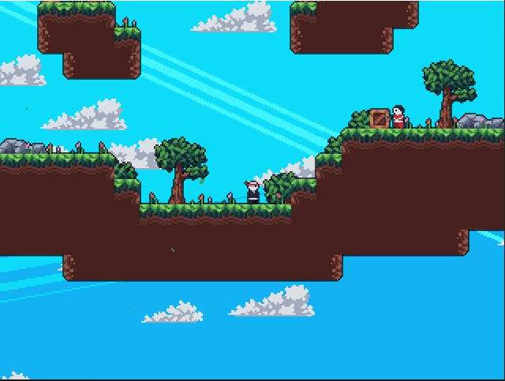

Pygame_ is a free and open-source cross-platform library
for the development of multimedia applications like video games using Python.
It uses the `Simple DirectMedia Layer library`_ and several other
popular libraries to abstract the most common functions, making writing
these programs a more intuitive task.

`We need your help`_ to make pygame the best it can be!
New contributors are welcome.

Installation
------------

Before installing pygame, you must check that Python is installed
on your machine. To find out, open a command prompt (if you have
Windows) or a terminal (if you have MacOS or Linux) and type this:
::

   `python --version`

If a message such as "Python 3.8.10" appears, it means that Python
is correctly installed. If an error message appears, it means that
it is not installed yet. You must then go to the `official website
<https://www.pygame.org/docs/>`_ and follow the instructions.

Once Python is installed, you have to perform a final check: you have
to see if pip is installed. Generally, pip is pre-installed with
Python but we are never sure. Same as for Python, type the following
command:
::

   `pip --version`

If a message such as "pip 20.0.2 from /usr/lib/python3/dist-packages/pip
(python 3.8)" appears, you are ready to install pygame! To install
it, enter this command:
::

   `pip install pygame`

Help
----

If you are just getting started with pygame, you should be able to
get started fairly quickly.  Pygame comes with many tutorials and
introductions.  There is also full reference documentation for the
entire library. Browse the documentation on the `docs page`_. You
can also browse the documentation locally by running
``python -m pygame.docs`` in your terminal. If the docs aren't found
locally, it'll launch the online website instead.

The online documentation stays up to date with the development version
of pygame on GitHub.  This may be a bit newer than the version of pygame
you are using. To upgrade to the latest full release, run 
``pip install pygame --upgrade`` in your terminal.

Best of all, the examples directory has many playable small programs
which can get you started playing with the code right away.

Pygame is a powerful library for game development, offering a wide 
range of features to simplify your coding journey. Let's delve into 
what pygame has to offer:

Graphics: With pygame, creating dynamic and engaging graphics has
never been easier. The library provides simple yet effective tools for
2D graphics and animation, including support for images, rectangles, 
and polygon shapes. Whether you're a seasoned game developer or just
starting out, pygame has you covered.

Sound: Pygame also includes support for playing and manipulating sound
and music, making it easy to add sound effects and background music to
your games. With support for WAV, MP3, and OGG file formats, you have 
plenty of options to choose from.

Input: Pygame provides intuitive functions for handling keyboard, mouse,
and joystick input, allowing you to quickly and easily implement player
controls in your games. No more struggling with complex input code, pygame
makes it simple.

Game Development: Lastly, pygame provides a comprehensive suite of tools
and features specifically designed for game development. From collision 
detection to sprite management, pygame has everything you need to create
exciting and engaging games. Whether you're building a platformer, puzzle
game, or anything in between, pygame has you covered.
